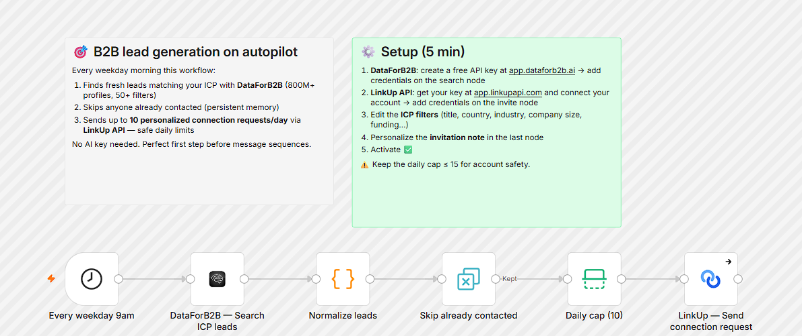
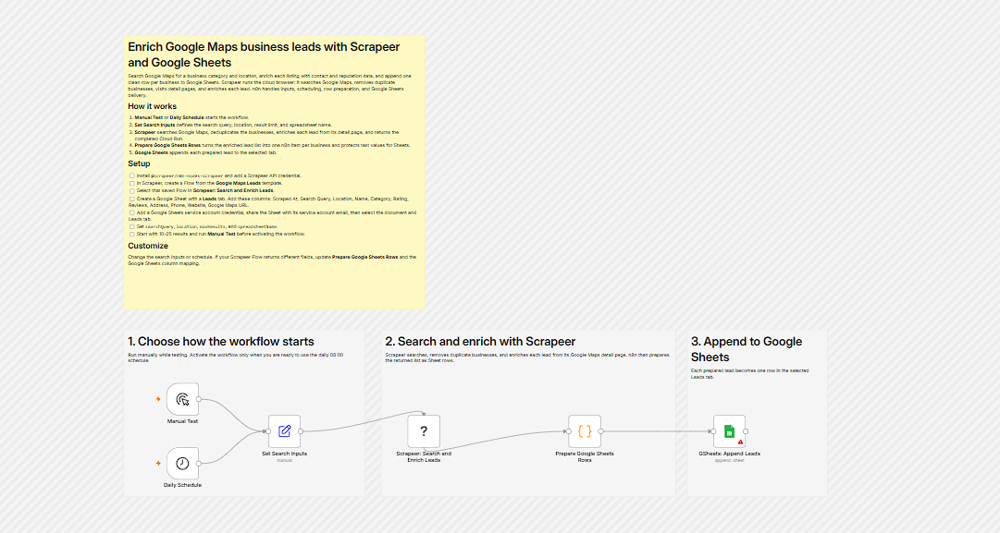
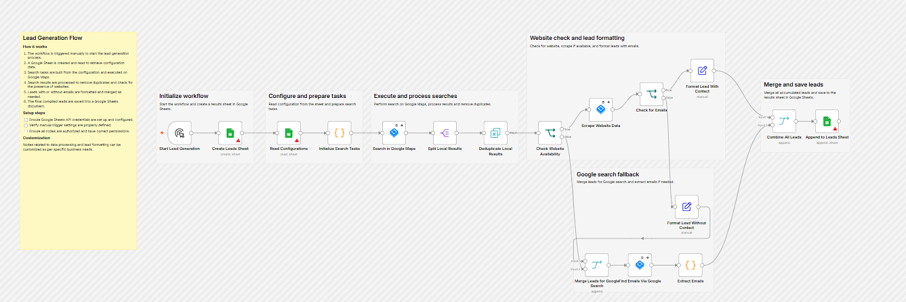
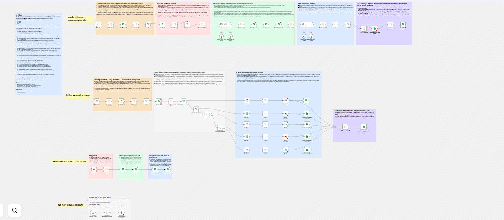
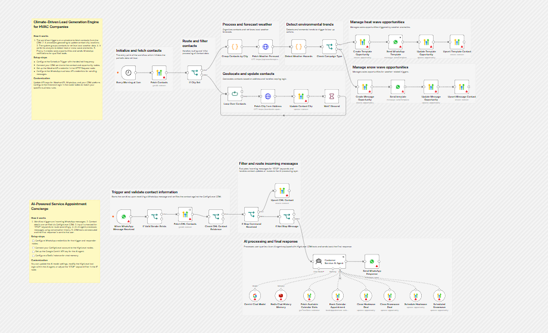
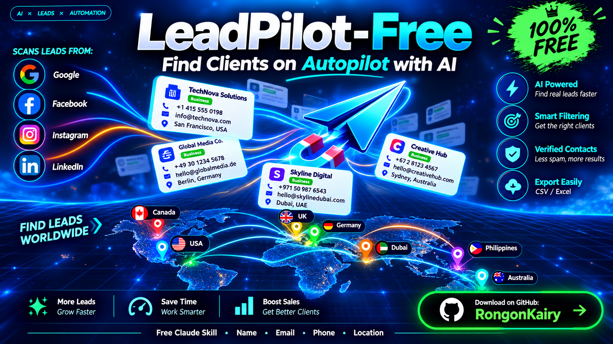

# 🚀 LeadPilot-Free

> Free n8n workflows to automate lead generation: find, collect, and organize leads on autopilot. No coding needed.


**LeadPilot-Free** is a collection of 5 ready-to-import [n8n](https://n8n.io) workflows that help you generate leads for free. Download the JSON file, import it into n8n, add your credentials, and run.

---


## ✨ Features

- 100% free and open source
- 5 ready-to-use n8n workflows
- Import in one click (JSON files)
- Beginner friendly, no coding required
- Easy to customize for your own niche
- Works with n8n Cloud and self-hosted n8n

---

## 🧩 Workflows Included

> ✏️ Edit the titles and descriptions below to match what each of your workflows does.

### 1️⃣ Workflow 1: Generate daily LinkedIn B2B leads with DataForB2B and LinkUp




📥 File: [`Download 1`](https://github.com/RongonKairy/LeadPilot-Free/releases/tag/LeadPilot-Free#:~:text=Generate.daily.LinkedIn.B2B.leads.with.DataForB2B.and.LinkUp.json)

---

### 2️⃣ Workflow 2: Enrich Google Maps business leads with Scrapeer and Google Sheets




📥 File: [`Download 2`](https://github.com/RongonKairy/LeadPilot-Free/releases/tag/LeadPilot-Free#:~:text=Enrich.Google.Maps.business.leads.with.Scrapeer.and.Google.Sheets.json)

---

### 3️⃣ Workflow 3: Scrape B2B leads from Google Maps to Google Sheets with HasData




📥 File: [`Download 3`](https://github.com/RongonKairy/LeadPilot-Free/releases/tag/LeadPilot-Free#:~:text=Scrape.B2B.leads.from.Google.Maps.to.Google.Sheets.with.HasData.json)

---

### 4️⃣ Workflow 4: Automate B2B cold email outreach with Gemini, Gmail and Google Sheets




📥 File: [`Download 4`](https://github.com/RongonKairy/LeadPilot-Free/releases/tag/LeadPilot-Free#:~:text=Automate.B2B.cold.email.outreach.with.Gemini.Gmail.and.Google.Sheets.json)

---

### 5️⃣ Workflow 5: Trigger HVAC upsell campaigns from weather data and handle bookings with GoHighLevel, WhatsApp, WeatherAPI and Gemini




📥 File: [`Download 5`](https://github.com/RongonKairy/LeadPilot-Free/releases/tag/LeadPilot-Free#:~:text=Trigger.HVAC.upsell.campaigns.from.weather.data.and.handle.bookings.with.GoHighLevel.WhatsApp.WeatherAPI.and.Gemini.json)

---

## 📋 Requirements

- An [n8n](https://n8n.io) account (Cloud) or a self-hosted n8n instance
- Accounts and API keys for the tools used in the workflows, for example:
  - Google account (Google Sheets / Gmail)
  - [Add other tools or APIs you use]

---

## ⚙️ Installation

1. Clone the repository:

   ```bash
   git clone https://github.com/rongonkairy/LeadPilot-Free.git
   cd LeadPilot-Free
   ```

2. Or download it as a ZIP: click **Code → Download ZIP** on the repo page.

3. Open the `workflows/` folder and pick the workflow you want.

---

## 📥 How to Import a Workflow

1. Open your n8n dashboard.
2. Click **Workflows → Add workflow** (or create a new workflow).
3. Click the **⋯** menu (top right) and select **Import from File**.
4. Choose a `.json` file from the `workflows/` folder.
5. The workflow will appear on your canvas.

---

## 🔑 Configuration

After importing, set up each workflow:

1. **Add your credentials.** Open each node that shows a warning icon and connect your account or API key.
2. **Update the settings.** Change the search keywords, Google Sheet, email, or any other value to your own.
3. **Test it.** Click **Execute Workflow** and check the output.
4. **Activate it.** Turn on the **Active** toggle to run it automatically.

> ⚠️ Never share your API keys or credentials publicly. This repo contains no secrets, and you should keep yours private.

---

## 📁 Project Structure

```
LeadPilot-Free/
├── README.md
├── LICENSE
├── assets/
│   ├── 1.png
│   ├── 2.png
│   ├── 3.png
│   ├── 4.png
│   ├── 5.png
│   └── poster.png
```

---

## 🛠 Customization

- Change the trigger (manual, schedule, webhook) to fit how you work.
- Replace the data source or output (Google Sheets, CRM, email) with your own.
- Combine two or more workflows into one automation.
- Add filters to keep only high-quality leads.

---

## ❓ Troubleshooting

| Problem | Solution |
|---|---|
| Node shows a red or warning icon | Add or re-connect your credentials in that node |
| Workflow does not run automatically | Make sure the **Active** toggle is on |
| Import fails | Check that the JSON file is complete and not edited by mistake |
| No leads returned | Check your keywords, filters, and API limits |

---

## 🤝 Contributing

Contributions are welcome!

1. Fork this repository
2. Create a new branch (`git checkout -b feature/my-feature`)
3. Commit your changes
4. Push to your branch and open a Pull Request

Found a bug or have an idea? [Open an issue](https://github.com/rongonkairy/LeadPilot-Free/issues).

---

## 🎯 LeadPilot-Free Skill

[

Find leads with AI directly inside Claude. The **LeadPilot-Free Skill** searches Google, Facebook, Instagram, LinkedIn, and country business directories to collect names, emails, phone numbers, and locations.

📥 **Download:** [LeadPilot-Free Skill.md](https://github.com/RongonKairy/LeadPilot-Free/releases/tag/Skill.md)

---

## 📄 License

This project is licensed under the **MIT License**. You are free to use, modify, and share it.

---

## 👤 Author

**RongonKairy**

- GitHub: [@rongonkairy](https://github.com/rongonkairy)
- YouTube: [@RongonKairy](https://www.youtube.com/@RongonKairy)

---

⭐ If this project helps you, please give it a **star** on GitHub!
